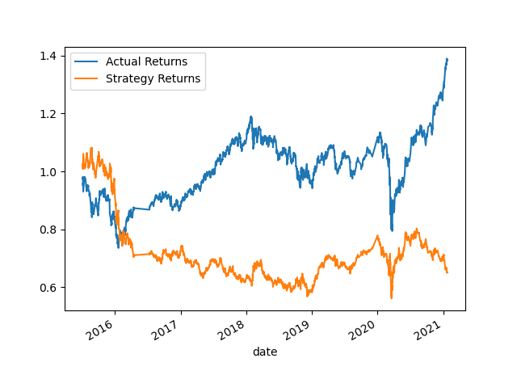

# Algorithmic Trading

## Overview
As a financial advisor in today's market it benefits one to use computer algorithms to manage and automatically trade assets in a highly dynamic environments. In this notebook you will see the imlpementation of algorithmic trading strategies that use machine learning to automate the trade decision. All code is accessible via this JupyterNotebook: machine_learning_trading_bot.ipynb.

## Evaluation Report 
1.  Tuning the training algorithm by adjusting the size of the training dataset.
    - Parameters:
    - Results: 
    - Answer: 
    
2. Tuning the trading algorithm by adjusting the SMA input features.
    - Parameters:
    - Results: 
    - Answer:
      
3. Logging the parameters that best improved the trading algorithm returns.
    
    - Conclusion:

4. Backtesting new model to evaluate performance
    
     - Conclusion: 

## Libraries & Dependencies
- Pandas
    - DateOffset
- Numpy
- Pathlib
- Hvplot
- Matplotlib
    - Pyplot
- Sklearn 
    - Support Vector Machine learning method
    - StandardScaler
    - Classification_report

## Datasource
- emerging_markets_ohlcv.csv
