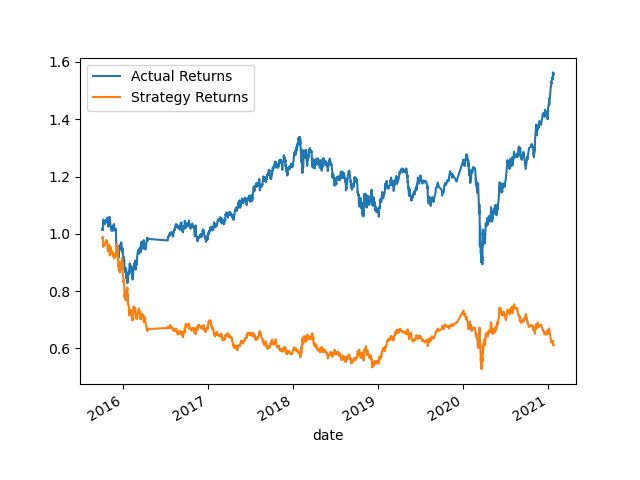
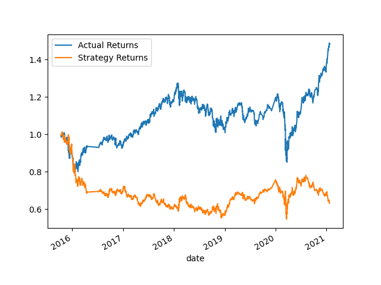

# Algorithmic Trading

## Overview
As a financial advisor in today's market it benefits one to use computer algorithms to manage and automatically trade assets in a highly dynamic environments. In this notebook you will see the imlpementation of algorithmic trading strategies that use machine learning to automate the trade decision. All code is accessible via this JupyterNotebook: machine_learning_trading_bot.ipynb.

## Evaluation Report 
1(a). Baseline Trading Algorithm

      
- Parameters: Short Window = 4 ; Long Window= 100; Training Data ending period is set to an offset =  3 (months)
- Results: Acutal Returns = 1.386976; Strategy Returns = 0.652249

1(b).  Tuning the training algorithm by adjusting the size of the training dataset.
     
- Parameters: Short Window = 4 ; Long Window= 100; Training Data ending period is set to an offset =  6 (months)
- Results: Acutal Returns = 1.560429; Strategy Returns = 0.612493
- Answer: Increasing the training parameter, increasing the size of the dataset negatively impacted the results. The difference between the Actual returns and Strategy increased.

2. Tuning the trading algorithm by adjusting the SMA input features.
   
- Parameters: Short Window = 5 ; Long Window= 126; Training Data ending period is set to an offset =  6 (months)
- Results: Acutal Returns = 1.486222; Strategy Returns = 0.634052
- Answer: Adjusting the SMA windows slighly from 4 to 5(business week) and 100 to 126(half of a trading year) the results improved slightly.

3. Logging the parameters that best improved the trading algorithm returns.
    
- Parameters: Short Window = 5 ; Long Window= 126; Training Data ending period is set to an offset =  6 (months)
- Results: Acutal Returns = 1.486222; Strategy Returns = 0.634052
- Conclusion: Adjusting the SMA windows slighly from 4 to 5(business week) and 100 to 126(half of a trading year) as well as the training data to 6 months produces the best results. These results are more inline with the baseline algorithm.

4. Backtesting new model to evaluate performance
    
- Conclusion: The original baseline model performed the best out off all tested alternatives. It seems that in lengthening the SMA parameters up as well as increasing the training dataset does no produce better results. Perhaps reducing the SMA     windows and/or training dataset could produce better results, better than the baseline model.

## Libraries & Dependencies
- Pandas
    - DateOffset
- Numpy
- Pathlib
- Hvplot
- Matplotlib
    - Pyplot
- Sklearn 
    - Support Vector Machine learning method
    - StandardScaler
    - Classification_report

## Datasource
- emerging_markets_ohlcv.csv
- cumulative_return_svm_plot.png
- cumulative_return_svm_plot1.png
- cumulative_return_svm_plot2.png
- cumul_return_lgm_plot.png
